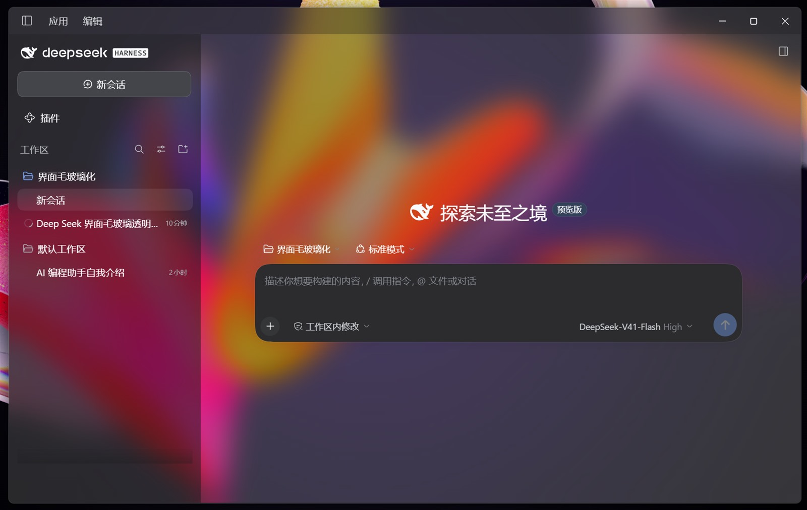
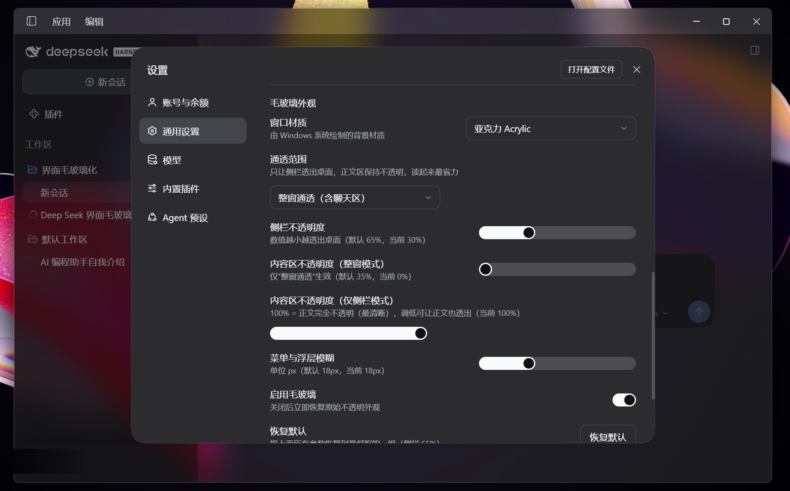

# DeepSeek Harness 毛玻璃外观（Windows Acrylic / Mica）

给 DeepSeek Harness 的桌面窗口换上 Windows 原生背景材质：桌面和后面的窗口透过系统材质模糊可见，界面的层级与正文清晰度不受影响。参数都在 **设置 → 通用 → 毛玻璃外观** 里调，改完即时生效。

> 与 DeepSeek 官方无关。这是一个本地外观补丁：只改你本机已装的 Harness，不联网，不碰账号数据。



*实际运行效果：桌面壁纸透过亚克力材质模糊可见，标题栏按钮画在透明标题栏上，正文保持清晰。*

---

## 需要什么

| 项目 | 要求 |
| --- | --- |
| 系统 | Windows 11 22H2 或更高（Acrylic / Mica 依赖 DWM 背景材质，Windows 10 不支持） |
| 系统设置 | 「透明效果」处于开启状态（设置 → 个性化 → 颜色） |
| DeepSeek Harness | 0.2.0-rc.2（Electron 44）。其它版本大多也能用；窗口代码和预期对不上时脚本会报错退出，不会写出坏补丁 |
| Node.js | **不需要**。脚本使用 Harness 自带的 Node 运行时 |

## 由两部分组成

| 部分 | 作用 | 生效时机 |
| --- | --- | --- |
| **shell 补丁** | 让主进程创建窗口时启用 `backgroundMaterial` 并把窗口背景设为完全透明 | 需要重启（下次启动生效） |
| **插件** | 注入透明化样式、提供设置项、实时切换材质 | 不需要重启（客户端插件热更新） |

shell 补丁只改安装目录里 `app.asar` 的两个文件（`lib/main.js`、`lib/preload-app.cjs`），其余 11000+ 个条目**逐字节不变**，脚本会自己验证这一点，原始归档备份为 `app.asar.original`。

## 安装

```powershell
# 1) 安装插件（复制到 %USERPROFILE%\.dsh\plugins 并写入 profile 补丁，自动备份）
powershell -ExecutionPolicy Bypass -File tools\install-plugin.ps1 -Action install

# 2) 生成 shell 补丁（自动定位安装目录，也可 --install "<含 DeepSeek Harness.exe 的目录>"）
& "$env:USERPROFILE\.dsh\dsh-runtimes\dsh-primary-runtime\dependencies\node\bin\node.exe" tools\patch-shell.mjs

# 3) 落盘（应用开着也能落盘；会自动备份原 app.asar）
powershell -ExecutionPolicy Bypass -File tools\apply-glass.ps1 -Action apply

# 4) 重启 DeepSeek Harness
```

`apply` 在整个文件被占用时（应用正在运行）会**只改写差异字节区间**（约 400 KB，分两段），因此不必先关应用；补丁在下次启动时生效。

随时查看状态：

```powershell
powershell -ExecutionPolicy Bypass -File tools\apply-glass.ps1 -Action status
powershell -ExecutionPolicy Bypass -File tools\install-plugin.ps1 -Action status
```

## 使用

**设置 → 通用 → 毛玻璃外观**：



| 参数 | 默认 | 说明 |
| --- | --- | --- |
| 窗口材质 | 亚克力 Acrylic | 亚克力 Acrylic / 云母 Mica / 标签页 Tabbed / 关闭 |
| 通透范围 | 仅侧栏与标题栏通透 | 或「整窗通透」 |
| 侧栏不透明度 | 65% | 越小越透；这就是「恢复默认」回到的值 |
| 内容区不透明度（整窗模式） | 35% | 仅「整窗通透」生效 |
| 内容区不透明度（仅侧栏模式） | 100% | 100% = 正文完全不透明，最清晰 |
| 菜单与浮层模糊 | 18px | Harness 自带菜单/浮层的模糊强度 |
| 启用毛玻璃 | 开 | 总开关 |
| 恢复默认 | — | 一键回到上面这组数值 |

参数保存在本机（`localStorage` 键 `dsh-plugin-glass.settings`）。

## 卸载 / 回滚

```powershell
powershell -ExecutionPolicy Bypass -File tools\apply-glass.ps1 -Action rollback      # 还原原始 app.asar
powershell -ExecutionPolicy Bypass -File tools\install-plugin.ps1 -Action remove     # 移除插件与 profile 行
```

## 应用更新之后

Harness 自动更新会替换 `app.asar`，补丁随之失效。插件检测到补丁不在就会自动关掉毛玻璃，不会留下半透明白屏，重新执行上面的第 2、3 步即可。

## 它是怎么工作的

1. **主进程**：创建 Windows 主窗口时加上 `backgroundColor: "#00000000"` 与 `backgroundMaterial: "acrylic"`，并新增一个带发送方校验的 IPC 通道，让渲染层可以实时切换材质。
2. **渲染层**：Harness 的布局会在 `body`、框架层（`.BynINW_frame`）和内容列上画不透明底色，Windows 下没有清空框架层的规则（只有 `data-platform="darwin"` 分支有）。插件把这些底色清成透明，把侧栏填充令牌改成半透明，把内容列的 16px 圆角方角化（否则接缝处会露出一小块只有原生材质的洞），再把 Windows 标题栏的填充设为全透明。标题栏按钮因此和顶栏连成一片，接缝消失。
3. **参数**：以 CSS 变量 + 内联 `!important` 应用（宿主注入的样式表在启动时追加到 `<head>` 末尾，靠文档顺序会输给它）。

**作用域**：插件注入的选择器全部限定在 `[data-dsh-glass*]` 属性或「毛玻璃已启用」状态之下，不影响产品其它样式；关闭毛玻璃时相关内联属性与样式表内容会被清空。下拉与开关直接用 Harness 自带的 `Menu` / `Switch` / `Button` 和图标，观感与产品同源。

## 已知限制

- Acrylic 的模糊半径由系统 DWM 固定，不可调；能调的是底色浓淡和通透范围。
- Acrylic 在拖动/缩放窗口时开销略高；觉得卡可切 `Mica` 或 `关闭`。
- Harness 的设置服务不接受「由补丁 `insert` 引入的行」的表单写入，因此参数保存在本机而不是写回 profile。
- Harness 没有滑块组件，滑块是自绘的，但几何与令牌对齐 `Switch`（20px 胶囊、16px 圆钮、2px 内边距）。
- 与具体版本耦合：换 Harness 版本后如果窗口代码变了，补丁脚本会报错停止。

## 快速开始（English）

Windows 11 22H2+ only. Adds the native Acrylic/Mica backdrop to the DeepSeek Harness desktop window, with live-tunable settings under **Settings → General → Glass appearance**.

```powershell
powershell -ExecutionPolicy Bypass -File tools\install-plugin.ps1 -Action install
& "$env:USERPROFILE\.dsh\dsh-runtimes\dsh-primary-runtime\dependencies\node\bin\node.exe" tools\patch-shell.mjs
powershell -ExecutionPolicy Bypass -File tools\apply-glass.ps1 -Action apply
```

The shell patch rewrites only `lib/main.js` and `lib/preload-app.cjs` inside the installed `app.asar` (all other entries stay byte-identical, verified by the tooling) and keeps a backup as `app.asar.original`. Roll back any time with `apply-glass.ps1 -Action rollback`.

## 许可与致谢

- 本仓库代码：MIT（见 [LICENSE](LICENSE)）。
- 随包附带 `@deepseek-ai/schemastery` 与 `@deepseek-ai/cosmokit`（MIT，版权归原作者），仅用于让插件在 Harness 运行时之外能解析依赖。
- 与 DeepSeek 官方无隶属关系；补丁只作用于你本机已安装的程序，请自行评估风险。
